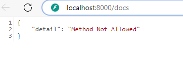
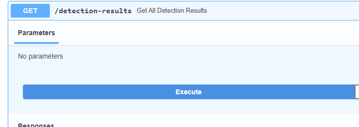

# Test on local host with Docker
To run  CAD-AID backend API using swagger on local host in Docker, execute following steps:

### 1. Build the Docker image
Start Docker desktop application.

In the project's terminal, cd  into the folder cadaid_api and write:
```
docker-compose -f docker-compose.dev.yml up --build
```

### 2.  Start the docker container
In project's terminal, write the command (ensure you're still in folder 'cadaid_api):
```
docker-compose -f docker-compose.dev.yml up 

```
### 3. Run detection api
In Docker desktop, click on the link to view the detection api in swagger.

Write /docs in the url:



### 4.Run feedback api
Perform step 3 for feedback api (without closing detect api window)

In detect api, retrieve the results with GET method:


